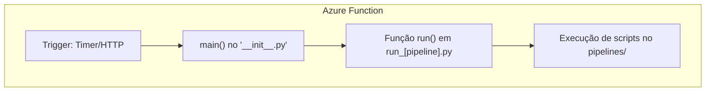

# 🏗 Arquitetura — Luxor Data Pipelines

O **Luxor Data Pipelines** foi projetado para rodar **100% no Azure** utilizando **Azure Functions** como mecanismo de execução.  
A arquitetura foi pensada para garantir **modularidade, escalabilidade e facilidade de manutenção** dos pipelines de dados.

---

## 📂 Organização de Diretórios

A estrutura é dividida em **duas partes principais**:

1. **`pipelines/`**  
    - Contém a **lógica principal** de cada processo de ETL.  
    - Cada arquivo representa um pipeline independente.  
    - Cada script deve expor um método **`run()`** que recebe parâmetros opcionais para controlar a execução.

2. **Diretórios `run_[NOME_DO_PIPELINE]/`**  
    - Cada diretório corresponde a uma **Azure Function** individual.  
    - Responsável por **orquestrar** a execução do pipeline definido em `pipelines/`.  
    - Contém:
        - `functions.json` → Configuração da Azure Function (tipo de trigger, agendamento, bindings, etc.).
        - `__init__.py` → Ponto de entrada da Azure Function. Importa a DAG (pipeline) e executa via `main()`.
        - `[nome_do_pipeline].py` → Define a **DAG** do pipeline, importando funções/módulos de `pipelines/` e compondo a execução.

---

## 🔄 Fluxo de Execução

<div alingn="center">

</div>

1. O **gatilho** (Timer Trigger ou outro) dispara a execução.
2. O **`main()`** do `__init__.py` chama o **`run()`** da DAG definida no arquivo `.py` do diretório `run_...`.
3. O **`run()`** da DAG importa e executa as funções `run()` dos módulos em `pipelines/`.
4. O processamento é feito (extração, transformação, carga) e os resultados são salvos no ADLS.

---

## 📌 Exemplo de Estrutura

```
luxor-data-pipelines/
│
├── pipelines/
│   └── hist_returns.py
│
└── run_hist_returns/
    ├── __init__.py
    ├── functions.json
    └── run_hist_returns.py
```

---

### Exemplo de `pipelines/hist_returns.py`

```python
def run(ref_date=None):
    AZURE_STORAGE_CONNECTION_STRING = os.environ.get("AZURE_STORAGE_CONNECTION_STRING")
    logging.info("Running hist_returns.run()")
    lq = LuxorQuery(adls_connection_string=AZURE_STORAGE_CONNECTION_STRING)

    if ref_date is None:
        ref_date = dt.date.today()
        ref_date = dt.date(ref_date.year, ref_date.month, 1) - dt.timedelta(days=1)
    ref_date = lq.get_month_end(ref_date)

    logging.info(f"Rodando para {ref_date}")
    returns_data = get_returns(lq, ref_date)

    if returns_data is not None and not returns_data.empty:
        incremental_load(lq, 'hist_returns', returns_data, normalize_columns=True)
    else:
        logging.info(f"Nenhum dado gerado para {ref_date}.")
```

---

### Exemplo de `run_hist_returns/run_hist_returns.py`

```python
from pipelines import hist_returns

def run():
    hist_returns.run()
```

---

### Exemplo de `run_hist_returns/__init__.py`

```python
import logging
from dotenv import load_dotenv
from run_hist_returns.run_hist_returns import run

load_dotenv()

def main(mytimer):
    logging.info("Executando função run_hist_returns")
    try:
        run()
        logging.info("Execução concluída com sucesso.")
    except Exception as e:
        logging.error(f"Erro: {e}")
        raise
```

---

### Exemplo de `run_hist_returns/functions.json`

```json
{
  "scriptFile": "__init__.py",
  "bindings": [
    {
      "name": "mytimer",
      "type": "timerTrigger",
      "direction": "in",
      "schedule": "0 30 18 * * 1-5"
    }
  ]
}
```

---

## 💡 Boas Práticas

- Sempre manter a lógica de negócio em `pipelines/`, deixando o diretório `run_...` apenas para orquestração.
- Usar variáveis de ambiente para credenciais e configurações.
- Garantir que cada `run()` seja **idempotente** para evitar duplicação de dados.
- Configurar agendamentos (`schedule`) de acordo com a necessidade do negócio.
- Monitorar logs no Azure para identificar falhas rapidamente.

---
