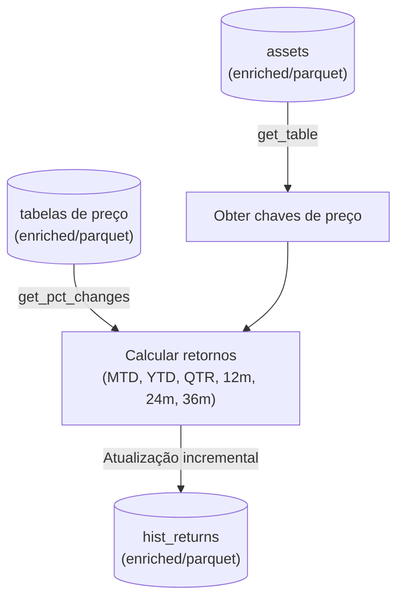

Pipeline para criação da tabela hist_returns.
Para todos os ativos da tabela assets, obtém a chave de preço e, utilizando o método get_pct_changes do módulo luxorasap, calcula os retornos mtd, ytd, qtr, 12m, 24 e 36m, nas moedas brl, usd e local fazendo uma atualização incremental da tabela hist_returns no ADLS. Utiliza sempre o último dia corrido do mês anterior como data de referência do cálculo. 
O pipeline está agendado para executar todos os dias uteis às 15h30m BRT.

# 📈 Pipeline `hist_returns`

## 📝 Descrição

O pipeline **`hist_returns`** é responsável pela criação e atualização incremental da tabela **`hist_returns`** no **Azure Data Lake Storage (ADLS)**.

### Funcionalidade
- Para **todos os ativos** listados na tabela `assets`:
  1. Obtém a **chave de preço** associada.
  2. Utiliza o método **`get_pct_changes`** do módulo `luxorasap` para calcular os seguintes retornos:
     - **MTD** (Month-to-Date)
     - **YTD** (Year-to-Date)
     - **QTR** (Quarter-to-Date)
     - **12m** (12 meses)
     - **24m** (24 meses)
     - **36m** (36 meses)
  3. Calcula cada retorno em **BRL**, **USD** e **moeda local**.
  4. Atualiza de forma **incremental** a tabela `hist_returns` no ADLS.
- A data de referência utilizada é **sempre o último dia corrido do mês anterior**.

---

## ⏰ Agendamento

- **Execução:** Todos os **dias úteis**  
- **Horário:** 15h30 (BRT)  
- **Trigger:** `timerTrigger` no Azure Functions

---